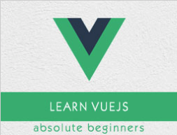

```
Roberto Nogueira  
BSd EE, MSd CE
Solution Integrator Experienced - Certified by Ericsson
```
# TutorialsPoint Vue.js



**About**
`VueJS` is a progressive JavaScript framework used to develop interactive web interfaces. Focus is more on the view part, which is the front end. It is very easy to integrate with other projects and libraries. The installation of `VueJS` is fairly simple, and beginners can easily understand and start building their own user interfaces. The content is divided into various chapters that contain related topics with simple and useful examples.

[Homepage](https://www.tutorialspoint.com/vuejs/index.htm)

## Topics
```
VueJS Tutorial
[ ] VueJS - Home
[ ] VueJS - Overview
[ ] VueJS - Environment Setup
[ ] VueJS - Introduction
[ ] VueJS - Instances
[ ] VueJS - Template
[ ] VueJS - Components
[ ] VueJS - Computed Properties
[ ] VueJS - Watch Property
[ ] VueJS - Binding
[ ] VueJS - Events
[ ] VueJS - Rendering
[ ] VueJS - Transition & Animation
[ ] VueJS - Directives
[ ] VueJS - Routing
[ ] VueJS - Mixins
[ ] VueJS - Render Function
[ ] VueJS - Reactive Interface
[ ] VueJS - Examples
VueJS Useful Resources
[ ] VueJS - Quick Guide
[ ] VueJS - Useful Resources
[ ] VueJS - Discussion
Selected Reading
[ ] Developer's Best Practices
[ ] Questions and Answers
[ ] Effective Resume Writing
[ ] HR Interview Questions
[ ] Computer Glossary
[ ] Who is Who
```
